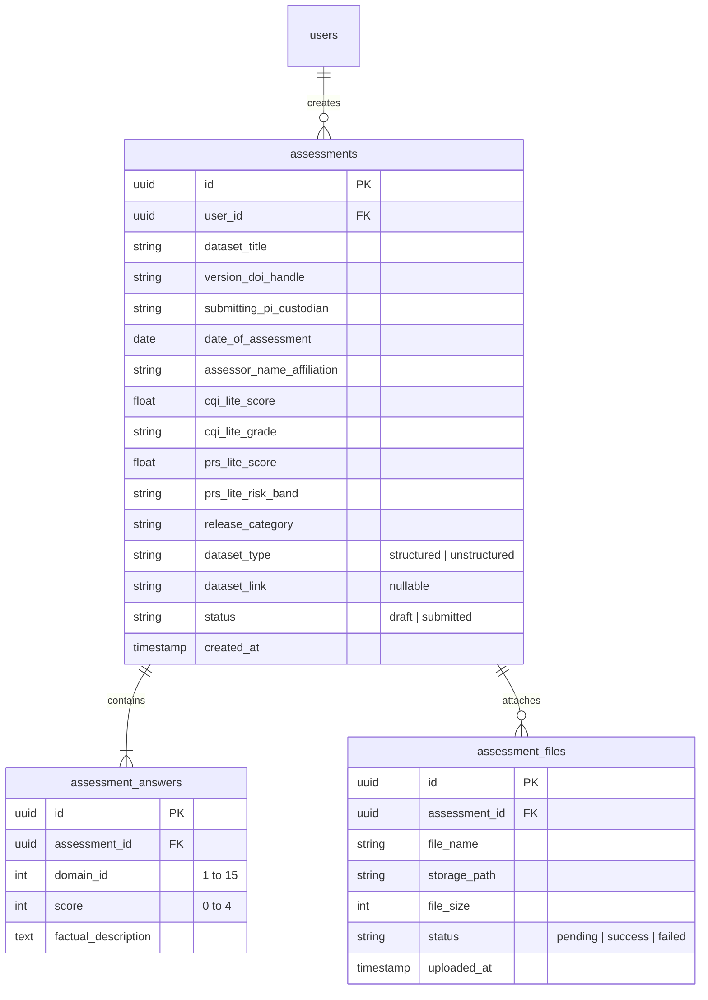

# Finalized Specifications: Building MIDAS Lite Form

This document outlines the finalized technical architecture, database schema, form structure, and system preferences for building the **ICMR MIDAS 2.0 (Lite Version) Self-Assessment Form** as discussed and agreed upon.

---

## 1. Technical Stack

*   **Frontend**: **Next.js (App Router)** + **Tailwind CSS** (UI, client-side routing, and Supabase Auth session management).
*   **Backend**: **FastAPI (Python)** (Handles API endpoints like `POST /api/v1/submit`, database operations, Redis caching, and file validation).
*   **Database**: **Supabase PostgreSQL** via **SQLModel** ORM (managed in Python).
*   **Auth**: **Supabase Auth** on Next.js frontend. The JWT token is passed in the header to FastAPI, which verifies it.
*   **Draft Caching**: **Redis (hosted on Redis Cloud)**, accessed strictly via the FastAPI backend (`redis-py`).
*   **Validation**: **Zod** (frontend validation) and **Pydantic/SQLModel** (backend validation).

---

## 2. Port & Proxy Routing

To prevent CORS issues in development and production, Next.js acts as a reverse proxy:
*   **Next.js Frontend**: Runs on port `3000`.
*   **FastAPI Backend**: Runs on port `8000`.
*   **Proxy Configuration**: Next.js is configured via `next.config.js` to rewrite all client requests from `/api/v1/:path*` to the FastAPI backend (`http://localhost:8000/api/v1/:path*`). The browser communicates strictly with port `3000`.

---

## 3. Upload & Webhook Flow (Direct to Storage)

To scale file uploads without memory/connection bottlenecks on the server, we use a direct-to-storage presigned URL and asynchronous webhook flow:

1.  **Request Upload**: Browser asks FastAPI (`GET /api/v1/upload-url`) for a signed upload URL.
2.  **Generate URL**: FastAPI requests Supabase Storage for a Presigned PUT URL and returns it to the browser.
3.  **Direct Upload**: Browser uploads the CSV file directly to Supabase Storage via `PUT`.
4.  **Asynchronous Webhook**: Supabase PostgreSQL database fires a trigger (via the `pg_net` extension) to send a `POST` request directly to the FastAPI Webhook endpoint (`/api/v1/webhooks/storage`) when the file is successfully uploaded to `storage.objects`.
5.  **Validate**: FastAPI checks the uploaded file in Storage (validating that the extension is `.csv` and it is not empty) and updates the status of the file record.
6.  **Real-Time Update**: The Next.js frontend listens to changes in `assessment_files` via **Supabase Realtime Subscriptions** to instantly show the validation status (success checkmark or empty-file error) to the user.
    *   *Required Migration*: 
        ```sql
        ALTER PUBLICATION supabase_realtime ADD TABLE assessment_files;
        ```

---

## 4. Form Flow & Structure

### Section A: Basic Info (Plain Text Fields)
*   Dataset Title
*   Version / DOI / Handle
*   Submitting PI / Custodian
*   Date of Assessment
*   Assessor Name / Affiliation

### Section B: 15 Data Quality Domains
Each domain presents:
1.  **Level Selection (Score 0-4)**: Five interactive clickable cards displaying the exact level descriptions from the rubric.
2.  **Factual Description**: A text box to write details supporting the chosen level.
3.  *Special Condition*: **Domain 11** contains a "Not Applicable" toggle. If flagged:
    *   Its score is ignored in calculation.
    *   The CQI-Lite score denominator changes from `60` to `56`.

### Section C: PRS-Lite Calculator (Annexure I)
*   **Step 1: Identification Risk Selection** (Choices: 0, 5, 15, 30, 50 with descriptive text).
*   **Step 2: Sensitivity / Harm Multiplier** (Choices: 1.0, 1.5, 2.0 with stigma descriptions).

### Section D: Dataset Upload
A toggle determines the input type:
*   **If Structured**: A multi-file uploader allowing the user to upload one or more CSV files.
    *   *Validation*: Files are checked to verify they end in `.csv` and are not empty.
*   **If Unstructured**: A text input field to paste a reference URL/link.

---

## 5. Database Schema (Option C - Normalized)

We are using a normalized relational PostgreSQL schema in Supabase:



---

## 6. Form Lifecycle & Security

1.  **Draft State (Redis via FastAPI)**:
    *   As the user fills out the form, Next.js calls a FastAPI endpoint (`POST /api/v1/draft`) to save the in-progress draft to Redis, keyed by the user's `user_id`.
    *   Drafts persist temporarily in Redis until either the cache is cleared manually or the form is finalized and submitted.
2.  **Submission (PostgreSQL via FastAPI)**:
    *   Upon clicking "Submit", Next.js calls the FastAPI submit endpoint (`POST /api/v1/submit`).
    *   FastAPI runs final validation checks and performs backend calculations:
        *   **CQI-Lite Score & Grade**: `(Sum of Domain Scores / Max Score) * 100` and maps to grade (Diamond, Platinum, etc.). Max score is `56` if Domain 11 is NA, otherwise `60`.
        *   **PRS-Lite Score & Risk Band**: `round(Identification Risk * Multiplier)` capped at 100, and maps to band (Low, Moderate, etc.).
        *   **Release Category**: Looks up the 4x5 release matrix using the computed CQI Grade and PRS Risk Band.
    *   Scores and category are saved directly into the `assessments` table but **not** displayed on the user's frontend.
    *   FastAPI writes the finalized data permanently to PostgreSQL, associates the file records, and deletes the draft from Redis.
    *   Submitted assessments become read-only.
3.  **Privacy & Access Control**:
    *   **Submitting User**: Can fill forms, view drafts, and preview/view their own final submissions.
    *   **Nodal Team**: Has full read access to all submissions and uploaded files.
    *   **Evidence Files (CSVs)**: Uploaded to a private Supabase Storage Bucket, secured with Row Level Security (RLS) so only the creator and the Nodal Team can download them.