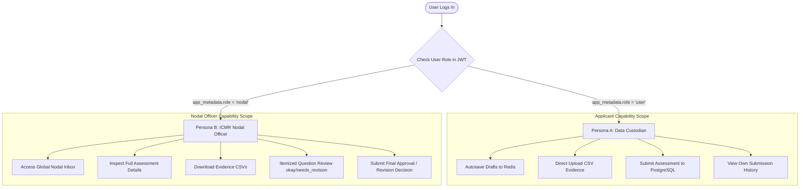
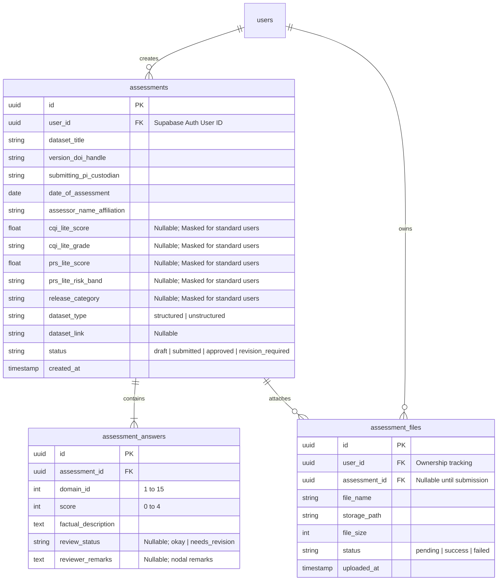

# Product Requirements Document (PRD)
## ICMR MIDAS 2.0 (Lite Version) — Dataset Quality and Trust Framework

**Document Version:** 1.0  
**Project Name:** MIDAS 2.0 (Metric-based Integrity and Data Assessment System - Lite Version)  
**Target Organization:** Indian Council of Medical Research (ICMR)  
**Status:** Implemented & Verified  

---

## 1. Executive Summary & Product Vision

### 1.1 Overview
The **ICMR MIDAS 2.0 Framework (Lite Version)** is a web-based self-assessment and technical evaluation platform designed to systematically measure the quality, integrity, interoperability, and privacy risk of health and medical datasets in India.

The Lite Version serves as a preliminary evaluation standard for **Independent Centers (Data Custodians)** prior to formal dataset onboarding into national AI-ready research repositories. Completed self-assessments are submitted to the **ICMR Nodal Centre** for expert evaluation, evidence auditing, and release classification.

### 1.2 Lite Version vs. Technical Version
- **Lite Version:** Simplified self-assessment tool using 0–4 score ladders across 15 core domains, enabling data custodians to record dataset readiness and calculate preliminary quality/privacy indices.
- **Technical Version:** Exhaustive, granular audit framework utilized by the ICMR Nodal Centre to verify submitted records, audit raw evidence, and compute final Composite Quality Index (CQI) and Privacy-Risk Score (PRS) benchmarks.

---

## 2. User Personas & System Roles

The system enforces strict Role-Based Access Control (RBAC) separating applicants from evaluators:



### Persona A: Data Custodian (Applicant)
- **Target User:** Principal Investigators (PIs), clinical researchers, data managers at Independent Centers.
- **Key Objectives:** Complete dataset self-assessment, attach supporting evidence documents (SOPs, validation logs), save in-progress form drafts, submit finalized assessments to the Nodal Centre.
- **Access Scope:** Standard role (`role: "user"`). Restricted strictly to creating, viewing, editing, and managing their own submitted datasets via database Row-Level Security (RLS).

### Persona B: ICMR Nodal Officer (Evaluator)
- **Target User:** ICMR domain experts, dataset auditors, nodal review officers.
- **Key Objectives:** Review incoming dataset assessments globally, inspect factual descriptions and uploaded CSV evidence, perform itemized per-domain question audits (`okay` / `needs_revision`), record evaluation remarks, and issue final approval decisions (`approved` / `revision_required`).
- **Access Scope:** Nodal role (`role: "nodal"`). Granted global read access to all system submissions, file downloads, and review endpoints via `require_nodal` dependencies.

---

## 3. Functional Requirements by Module

### Module 1: Section A — Basic Information (Dataset Metadata)
Captures fundamental administrative metadata regarding the dataset:
- **Dataset Title:** String (Indexed). Plain text title of the dataset.
- **Version / DOI / Handle:** String. Unique identifier or DOI handle.
- **Submitting PI / Custodian:** String. Name and designation of the data custodian.
- **Date of Assessment:** Date. Date on which self-assessment was conducted.
- **Assessor Name / Affiliation:** String. Name and institutional affiliation of the assessor.

### Module 2: Section B — 15 Data Quality Domains
Evaluates dataset quality across 15 structured governance domains:
1. **Annotation / Labelling Reliability**
2. **Metadata Completeness**
3. **Documentation & User Guidance**
4. **Population Representativeness**
5. **Data Structure & Interoperability**
6. **AI / Analytics Readiness**
7. **Privacy & Identifiability**
8. **Security & Access Governance**
9. **Provenance & Workflow Transparency**
10. **Ethical & Social Accountability**
11. **Synthetic / Simulated Data** *(Toggleable "If Applicable")*
12. **Stewardship & Governance**
13. **Model Linkage Integrity**
14. **Environmental Sustainability**
15. **Continuous Curation & Feedback**

#### Domain Requirements:
- **Scoring Ladder (0–4):** Each domain provides 5 clickable option cards representing levels from 0 (Absent) to 4 (Exemplary).
- **Factual Description:** 4-row required text area for short, factual justifications and evidence citations.
- **Domain 11 "Not Applicable" Toggle:** If flagged as N/A, Domain 11 score is excluded from calculation, and the CQI-Lite denominator dynamically shifts from `60` to `56`.
- **Non-Linear Navigation:** Interactive stepper timeline allowing non-linear micro-dot navigation across all 15 domains.

### Module 3: Section C — PRS-Lite Calculator (Privacy Risk)
Computes Privacy-Risk Score (PRS-Lite) using two user-selected risk parameters:
- **Step 1: Identification Risk Selection** (Choices: $0$ De-identified, $5$ Pseudonymized, $15$ Indirect Identifiers, $30$ Direct Identifiers, $50$ High Re-identification Potential).
- **Step 2: Sensitivity / Harm Multiplier** (Choices: $1.0$ General, $1.5$ Sensitive/Clinical, $2.0$ High Stigma/Clinical-Genomic).

### Module 4: Section D — Dataset Upload & Storage
Supports structured CSV evidence file uploads or reference web links:
- **Input Type Toggle:** Choice between `structured` (multi-file CSV upload) or `unstructured` (reference URL).
- **Direct Cloud Upload:** Frontend requests a 15-minute presigned PUT URL from FastAPI (`POST /api/v1/upload-url`) and uploads `.csv` files directly to Supabase Storage.
- **Asynchronous Webhook Validation:** Supabase Storage fires a webhook callback (`POST /api/v1/webhooks/storage`) authenticated via `X-Webhook-Secret` to validate `.csv` extensions and verify non-zero file sizes.

---

## 4. Mathematical Scoring Engine & Release Matrix

### 4.1 Composite Quality Index (CQI-Lite)
$$\text{CQI-Lite} = \left( \frac{\sum_{i=1}^{N} \text{Domain Score}_i}{\text{Max Score (56 or 60)}} \right) \times 100$$

| Aggregated CQI-Lite Score | Performance Grade | Interpretation |
| :--- | :--- | :--- |
| $\ge 95$ | **Diamond** | Global exemplar dataset |
| $85 - 94$ | **Platinum** | Best-practice dataset |
| $70 - 84$ | **Gold** | High-quality dataset |
| $50 - 69$ | **Silver** | Permissible; improvement plan required |
| $25 - 49$ | **Bronze** | Embargoed until targeted enhancements completed |
| $< 25$ | **Remediation** | Iterative QA and resubmission required |

### 4.2 Privacy-Risk Score (PRS-Lite)
$$\text{PRS-Lite} = \min\Big(\text{round}(\text{Identification Risk} \times \text{Sensitivity Multiplier}), 100\Big)$$

| PRS-Lite Score Band | Risk Classification | Action / Governance Requirement |
| :--- | :--- | :--- |
| $0 - 15$ | **Low Risk** | Eligible for Open release consideration |
| $16 - 40$ | **Moderate Risk** | Standard Controlled release governance |
| $41 - 70$ | **High Risk** | Restricted access; strong anonymization required |
| $71 - 100$ | **Very High Risk** | Strictly Restricted embargoed storage |

### 4.3 CQI-Lite × PRS-Lite Release Matrix Lookup Table
```text
+-------------------+-----------------+-----------------+-----------------+-----------------+-----------------+
| PRS \ CQI         | >=95 (Diamond)  | 85-94 (Platinum)| 70-84 (Gold)    | 50-69 (Silver)  | 25-49 (Bronze)  |
+-------------------+-----------------+-----------------+-----------------+-----------------+-----------------+
| Low (0-15)        | Open            | Open/Controlled | Controlled/Open | Controlled      | Restricted      |
| Moderate (16-40)  | Open/Controlled | Controlled      | Controlled      | Restricted      | Restricted      |
| High (41-70)      | Controlled      | Controlled      | Restricted      | Restricted      | Restricted      |
| Very High (71-100)| Restricted      | Restricted      | Restricted      | Restricted      | Restricted      |
+-------------------+-----------------+-----------------+-----------------+-----------------+-----------------+
```

---

## 5. Database ERD & Schema Architecture

The database utilizes a normalized relational PostgreSQL schema managed via SQLModel and Alembic:



---

## 6. Security, Privacy & Compliance Controls

### 6.1 Role-Aware Score Masking Policy
To prevent evaluation bias and preserve review integrity, calculated scores (`cqi_lite_score`, `cqi_lite_grade`, `prs_lite_score`, `prs_lite_risk_band`, `release_category`) are **masked to `null`** in API responses for non-nodal users (`role != "nodal"`) until the Nodal Officer completes formal review.

### 6.2 Token Bucket Rate Limiting (`apps/api/app/core/rate_limit.py`)
- Rate limits are executed atomically via a Redis Lua script on key `rate_limit:{user_id}`.
- Cost 1 endpoints (20 capacity, 0.33 tok/s): `/draft`, `/upload-url`, `/assessments`, `/download`, `/review`.
- Cost 10 endpoints (20 capacity, 0.33 tok/s): `/submit` (heavy transactional write).

### 6.3 Content Security Policy (CSP) & Security Headers
Next.js middleware generates per-request CSP base64 nonces (`btoa(crypto.randomUUID())`) and enforces:
- `X-Frame-Options: DENY`
- `X-Content-Type-Options: nosniff`
- `Referrer-Policy: strict-origin-when-cross-origin`
- `Permissions-Policy: camera=(), microphone=(), geolocation=()`

---

## 7. Non-Functional Requirements & Performance SLAs

1. **Form Draft Persistence:** Redis draft state autosaves in under 100ms; persistent for 14 days.
2. **File Upload Security:** Direct-to-storage presigned upload URLs expire strictly after 15 minutes; download URLs expire after 60 seconds.
3. **Database Concurrency:** Connection pool managed via SQLAlchemy/SQLModel session generator with automatic pool recycling.
4. **Browser Compatibility:** Supports Chrome 100+, Firefox 100+, Safari 15+, Edge 100+. Fully responsive layout down to 360px mobile viewports.