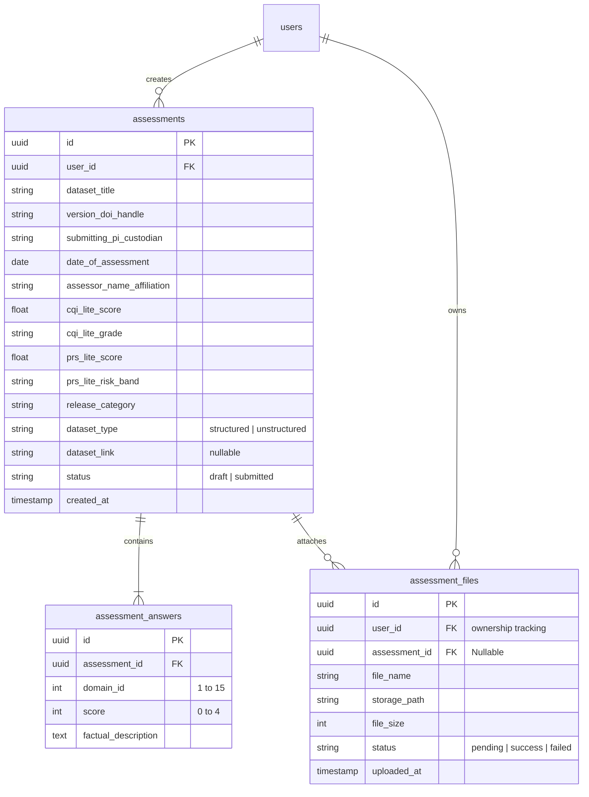

# Finalized Specifications: MIDAS Lite Form (Current Implementation)

This document outlines the technical architecture, database schema, form structure, and system preferences for the **ICMR MIDAS 2.0 (Lite Version) Self-Assessment Form** as implemented.

---

## 1. Technical Stack

*   **Frontend**: **Next.js (v16 App Router)** + **React 19** + **Tailwind CSS (v4) & Custom Scoped CSS** + **Next.js Server-side Middleware** (handles server-side session guards, CSP nonce injection, and security headers). 
    - The interactive form runs on `/dashboard` and preserves state via a debounced autosave connection (2-second debounce). UI navigation states (`step`, `activeDomainIdx`) are persisted in `localStorage` and cleared on reset/logout/submission.
    - Public pages (`/`, `/lite-version`, and `/login`) use the `.portal-home-page` scoped class from `portal-home.css`/`portal-theme.css` for consistent portal typography and colors while preserving normal document scrolling. The landing page (`/`) and framework page (`/lite-version`) additionally use the `PortalPageLayout` wrapper with `IntersectionObserver` scroll animation. The login page uses `PortalNav` directly instead of `PortalPageLayout`.
    - The `/login` page enforces credential submission via `method="POST"`, provides autocomplete properties, and blocks request spammers with a 30-second countdown rate limiter after 5 failed attempts. The page uses `PortalNav` across the top (showing "Expert Login" link when unauthenticated) and the login card is vertically/horizontally centered below the fixed nav via `h-[calc(100vh-72px)] mt-[72px]`. The card uses a glass-morphism style (`bg-white/90 backdrop-blur-md`) and the title uses `font-serif font-black`.
    - **CSP (Content Security Policy)**: Middleware generates a unique base64 nonce per request via `btoa(crypto.randomUUID())`. In production, a strict `Content-Security-Policy` header is set; in development, `Content-Security-Policy-Report-Only` is used to preserve HMR. Additional security headers: `X-Frame-Options: DENY`, `X-Content-Type-Options: nosniff`, `Referrer-Policy: strict-origin-when-cross-origin`, `Permissions-Policy: camera=(), microphone=(), geolocation=()`.
*   **Backend**: **FastAPI (Python)** (Handles API endpoints like `POST /api/v1/submit`, database operations, Redis caching, and file validation. Enforces router-level authentication dependencies and Redis-based token-bucket rate limiting).
*   **Database**: **Supabase PostgreSQL** via **SQLModel** ORM (managed in Python, with role-based PostgreSQL RLS policies).
*   **Auth**: **Supabase Auth** on Next.js frontend. Sessions are synced to cookies for middleware checks. JWT tokens are verified on FastAPI at the endpoint level by calling the Supabase Auth server's `/auth/v1/user` endpoint with the service role key (not local JWT decoding). Roles are extracted from the JWT `user_metadata -> role` claim. Cookies are configured with unified `SameSite=Lax`, `path=/`, and `Secure` (in production) options on both client and server to prevent session leaks and ensure proper logout.
*   **Draft Caching**: **Redis (hosted on Redis Cloud)**, accessed strictly via the FastAPI backend (`redis-py`). Drafts stored under key `draft:{user_id}` with a 14-day TTL.
*   **Rate Limiting**: **Token Bucket (Redis Lua script)**. Two limiters instantiated: `cost=1` (capacity 20, fill rate 0.33 tok/s) for lightweight endpoints, and `cost=10` (same capacity/fill rate) for the expensive `/submit` endpoint. Keys scoped per user as `rate_limit:{user_id}`. If Redis is unreachable, cost-1 requests pass through; cost-10 returns HTTP 503.
*   **Validation**: **HTML5 / UI State Checks** (frontend validation) and **Pydantic/SQLModel** (backend validation).

---

## 2. Port & Proxy Routing

To prevent CORS issues in development and production, Next.js acts as a reverse proxy:
*   **Next.js Frontend**: Runs on port `3000`.
*   **FastAPI Backend**: Runs on port `8000`.
*   **Proxy Configuration**: Next.js is configured via `next.config.js` to rewrite all client requests from `/api/v1/:path*` to the FastAPI backend (`http://localhost:8000/api/v1/:path*`). The browser communicates strictly with port `3000`.

---

## 3. Upload & Webhook Flow (Direct to Storage)

To scale file uploads without memory/connection bottlenecks on the server, we use a direct-to-storage presigned URL and asynchronous webhook flow:

1.  **Request Upload**: Browser asks FastAPI (`POST /api/v1/upload-url`) for a signed upload URL. A pending `assessment_files` row is created with `assessment_id = None` (nullable).
2.  **Generate URL**: FastAPI requests Supabase Storage for a Presigned PUT URL (formatted with the absolute `/storage/v1/` prefix) and returns it to the browser.
3.  **Direct Upload**: Browser uploads the CSV file directly to Supabase Storage via `PUT`.
4.  **Asynchronous Webhook**: Supabase PostgreSQL database fires a trigger (via the `pg_net` extension with `timeout_milliseconds`) to send a `POST` request directly to the FastAPI Webhook endpoint (`/api/v1/webhooks/storage`) when the file is successfully uploaded to `storage.objects`. The request is secured with a shared `WEBHOOK_SECRET`.
5.  **Validate**: FastAPI validates the webhook header secret, checks the uploaded file in Storage (validating that the extension is `.csv` and it is not empty), and updates the status of the file record.
6.  **Real-Time Update & Polling Fallback**: The Next.js frontend listens to changes in `assessment_files` via **Supabase Realtime Subscriptions** and simultaneously executes a 10-attempt, 1-second interval **polling fallback loop** (`verifyFileStatus`) to instantly show the validation status (success checkmark or empty-file error) and prevent UI race conditions.
7.  **Data Lifecycle Cleanup**: Unlinked pending files (`assessment_id IS NULL`) are automatically deleted during the final form submission in `endpoints.py`, and abandoned files are purged via a 24-hour database/storage expiry script (`cleanup_expired_files.py`).
    *   *Setup Automation*: The realtime publication subscription, storage bucket registration, schema table privileges (`setup_supabase_extras.py`), and RBAC/RLS policies (`deploy_rls_policies.py`) are executed programmatically.

---

## 4. Form Flow & Structure

### Section A: Basic Info (Plain Text Fields)
*   Dataset Title
*   Version / DOI / Handle
*   Submitting PI / Custodian
*   Date of Assessment
*   Assessor Name / Affiliation

### Section B: 15 Data Quality Domains
Each domain presents:
1.  **Level Selection (Score 0-4)**: Five interactive clickable cards displaying the exact level descriptions from the rubric. Configured with a dynamic hover translate lift physics (`hover:-translate-y-[2px] hover:shadow-2xs`) and a soft selected border glow.
2.  **Factual Description**: A 4-row text area to write details supporting the chosen level.
3.  *Special Condition*: **Domain 11** contains a "Not Applicable" toggle. If flagged:
    *   Its score is ignored in calculation.
    *   The CQI-Lite score denominator changes from `60` to `56`.
4.  **Stepper Branching**: When Section B is active, the single interactive progress timeline unfolds inline to display a horizontal sequence of 15 clickable micro-dots for non-linear domain navigation.

### Section C: PRS-Lite Calculator (Annexure I)
*   **Step 1: Identification Risk Selection** (Choices: 0, 5, 15, 30, 50 with descriptive text).
*   **Step 2: Sensitivity / Harm Multiplier** (Choices: 1.0, 1.5, 2.0 with stigma descriptions).

### Section D: Dataset Upload
A toggle determines the input type:
*   **If Structured**: A multi-file uploader allowing the user to upload one or more CSV files.
    *   *Validation*: Files are checked to verify they end in `.csv` and are not empty.
*   **If Unstructured**: A text input field to paste a reference URL/link.

---

## 5. Database Schema (Option C - Normalized)

We are using a normalized relational PostgreSQL schema in Supabase:

---

## 6. Form Lifecycle & Security

1.  **Draft State (Redis via FastAPI)**:
    *   As the user fills out the form, Next.js calls a FastAPI endpoint (`POST /api/v1/draft`) to save the in-progress draft to Redis, keyed by the user's `user_id`. The request includes the client session JWT verified via Supabase Auth server endpoint. Draft writes and reads are rate-limited (cost=1 token bucket).
    *   Drafts persist temporarily in Redis (14-day TTL) until either the cache is cleared manually or the form is finalized and submitted.
2.  **Submission (PostgreSQL via FastAPI)**:
    *   Upon clicking "Submit", Next.js calls the FastAPI submit endpoint (`POST /api/v1/submit`) with the session JWT. This endpoint is rate-limited with cost=10 (heavier cost).
    *   FastAPI runs final validation checks and performs backend calculations:
        *   **CQI-Lite Score & Grade**: `(Sum of Domain Scores / Max Score) * 100` and maps to grade (Diamond, Platinum, etc.). Max score is `56` if Domain 11 is NA, otherwise `60`.
        *   **PRS-Lite Score & Risk Band**: `round(Identification Risk * Multiplier)` capped at 100, and maps to band (Low, Moderate, etc.).
        *   **Release Category**: Looks up the 4x5 release matrix using the computed CQI Grade and PRS Risk Band.
    *   Scores and category are saved directly into the `assessments` table but **not** displayed on the user's frontend.
    *   FastAPI writes the finalized data permanently to PostgreSQL, associates the file records, and deletes the draft from Redis.
    *   **Auto-Cleanup**: Deletes any remaining unlinked draft `assessment_files` (where `assessment_id IS NULL`) for the user to prevent orphaned data.
    *   Submitted assessments become read-only.
3.  **Privacy & Access Control (Row-Level Security)**:
    *   **Route Guards**: Server-side Next.js middleware validates cookies and redirects unauthenticated traffic trying to access protected paths (like `/dashboard`) back to `/login`. Public routes `/` (Landing Page), `/lite-version`, and `/login` are accessible anonymously. Client-side state changes are synchronized via `AuthSessionWatcher`. If the active session is lost or if the draft API returns a 401, the client-side router redirects the user to `/login`.
    *   **Submitting User**: Can fill forms, view drafts, and view/edit/delete their own final submissions. Secured via database Row-Level Security (RLS) check: `auth.uid() = user_id`.
    *   **Nodal Team / Administrator Role**: Access is checked via dynamic claims verification: `auth.jwt() -> 'user_metadata' ->> 'role' = 'nodal'`. This dynamic mapping allows adding multiple nodal team accounts without database schema updates.
    *   **Backend Stateless Role Checks**: The FastAPI security engine extracts the user's role claim directly from the decrypted JWT payload (`user_metadata -> role`). Endpoints can enforce permissions in-memory via `require_nodal` dependencies without making extra database queries.
    *   **Role-Aware Query Routing**: The list assessments endpoint (`GET /api/v1/assessments`) uses `Depends(get_current_user)` to inspect the role claim. It dynamically exposes all records to `nodal` users while automatically restricting standard users to their own assessments.
    *   **Evidence Files (CSVs)**: Uploaded to a private Supabase Storage Bucket, secured with Row Level Security (RLS) so only the creator (under folder `evidence/auth.uid()/`) and the Nodal Team can download them, evaluated via dynamic role metadata claims.
    *   **Database Tables Security**: RLS is enabled on `assessments`, `assessment_answers`, and `assessment_files` to prevent cross-tenant data access, checking ownership and role properties.